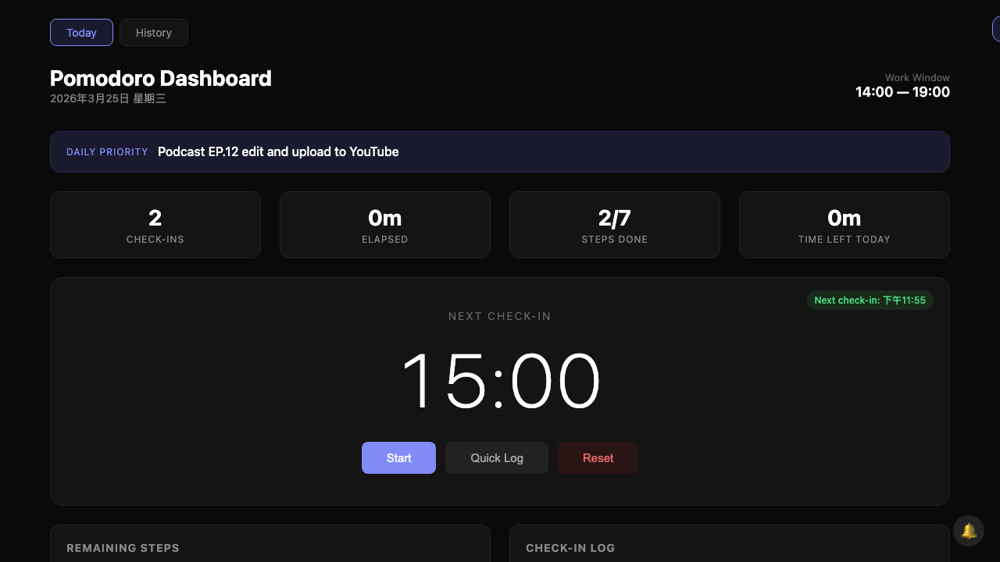

# Pomodoro Dashboard

A single-file, zero-dependency Pomodoro timer and productivity dashboard that runs entirely in your browser. All data is stored in `localStorage` — no server, no account, no tracking.



## Features

- **15-minute check-in cycle** — Timer counts down and prompts you to report what you're working on. Includes audio chime and Chinese TTS voice reminder.
- **Quick Log** — Record a note anytime (e.g., "going to exercise") without resetting or affecting the timer.
- **Task management** — Add, complete, and delete tasks dynamically.
- **Key Numbers** — Store important reference numbers for your current project.
- **Notes & Workflow Log** — Tag notes as Workflow / Problem / Insight / General. Great for post-session reflection and building future automation.
- **Daily Priority** — Set and display today's main goal.
- **Editable Work Window** — Define your working hours; the dashboard calculates remaining time.
- **Full persistence** — Everything is saved to `localStorage`. Timer state survives page refresh and resumes with correct elapsed time.
- **History** — Browse past days' check-ins, tasks, and notes.
- **Browser notifications** — Get notified even when the tab is in the background.
- **Nag reminders** — If you don't respond to a check-in, it reminds you every minute with audio + voice.
- **Eisenhower Matrix** — Manage all tasks with an urgent/important quadrant system. Focus on what matters (Q2: Not Urgent + Important). Tasks persist across days.
- **AI auto-categorization** — Optionally connect a Gemini API key. Each check-in is automatically analyzed and added to your Notes with the correct tag (workflow/problem/insight/general).
- **Cross-day date labels** — Check-in logs and notes show dates when entries span multiple days, with visual separators at day boundaries.

## Quick Start

1. Download or clone this repo
2. Open `dashboard.html` in your browser
3. Done. That's it.

```bash
git clone https://github.com/ryan234r32/pomodoro-dashboard.git
open pomodoro-dashboard/dashboard.html
```

No build step. No dependencies. No server. Just one HTML file.

## How to Use

### Timer

| Button | What it does |
|--------|-------------|
| **Start / Pause / Resume** | Controls the 15-minute countdown |
| **Quick Log** | Opens an inline input to record a timestamped note — timer keeps running |
| **Reset** | Resets the timer back to 15:00 |

When the timer reaches 0, a modal pops up asking what you're working on. Your response is saved to the Check-in Log.

### Quick Log vs. Auto Check-in

- **Quick Log** (yellow `quick` tag) — You initiated it. Timer is unaffected. Use it to record context switches like "going to lunch", "switching to email", etc.
- **Auto Check-in** (purple `check-in` tag) — The 15-minute timer triggered it. After you respond, the timer restarts.

### Notes & Workflow Log

Located below Key Numbers. Four tag categories:

- **Workflow** (green) — Document how your process works
- **Problem** (red) — Record issues and blockers
- **Insight** (purple) — Capture ideas and improvements
- **General** (yellow) — Everything else

Use `Cmd+Enter` to save quickly.

### Editable Fields

Click on these to edit inline:

- **Daily Priority** — Your main goal for the day
- **Work Window** start/end times — Affects the "Time Left Today" stat

## Data & Privacy

- All data lives in your browser's `localStorage` under the key `pomodoro-data`
- Nothing is sent to any server
- Timer state is auto-saved every 10 seconds and on page close (`beforeunload`)
- Each day's data is stored separately and accessible from the History tab

### Exporting Data

Open your browser console and run:

```js
copy(localStorage.getItem('pomodoro-data'))
```

This copies all your data as JSON to clipboard.

### Importing Data

```js
localStorage.setItem('pomodoro-data', '...paste JSON here...')
location.reload()
```

## Customization

Everything is in a single `dashboard.html` file. Common things you might want to change:

| Setting | Where | Default |
|---------|-------|---------|
| Check-in interval | `CHECKIN_INTERVAL` variable | 15 minutes (900 seconds) |
| TTS language | `speakChinese()` function | `zh-TW` |
| TTS name | `speakChinese()` function | "Ryan" |
| Default work window | `getTodayState()` function | 09:00 - 19:00 |

## Browser Support

Tested on modern Chromium browsers (Chrome, Arc, Edge, Brave) and Safari on macOS. Requires:

- `localStorage`
- `AudioContext` (for chime sounds)
- `SpeechSynthesis` (for voice reminders, optional)
- `Notification API` (for background notifications, optional)

## License

MIT
